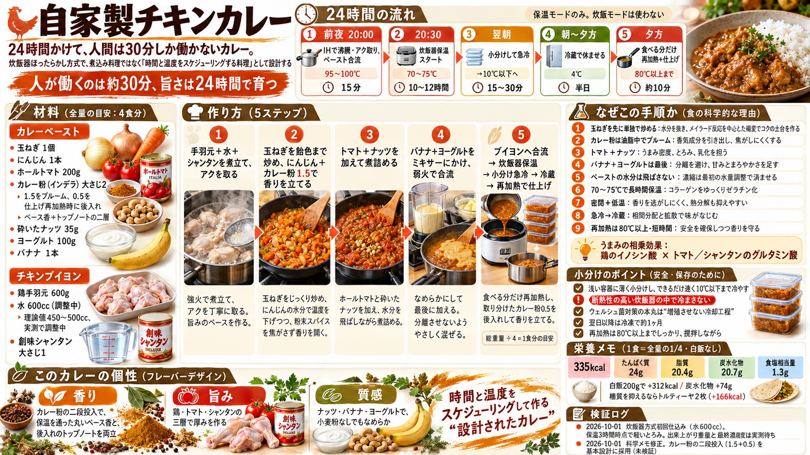

# 自家製チキンカレー

24時間かけて、人間は30分しか働かないカレー。
炊飯器ほったらかし方式で、煮込み料理ではなく「時間と温度をスケジューリングする料理」として設計する。

## 由来

20年前に通ったネパール料理店の、もう食べられなくなったカレーを追いかけて試行錯誤するうち、いつの間にか基準が「あの味に近いか」から「これは旨いか」に変わり、たどり着いたのがこの構成。記憶から生まれ、経験で磨かれ、科学で再設計されたカレー。

## 材料

### カレーペースト

- 玉ねぎ 1個
- にんじん 1本
- ホールトマト 200g
- カレー粉（インデラ） 大さじ2（うち大さじ1.5をテンパリングに、大さじ0.5を仕上げ再加熱時に後入れすると、保温を通った丸いベース香と後入れのトップノートの二層になる。スパイス感を立てたい場合は大さじ3まで増量可）
- 砕いたナッツ（カシューナッツ・ピーナッツ・アーモンド） 35g
- ヨーグルト 100g
- バナナ 1本

### チキンブイヨン

- 鶏手羽元 600g
- 水 600cc（暫定値。密閉調理では蒸発しないため煮詰め後と同じ濃度になるよう最初から減らす。理論値は450〜500ccで、実測で調整中）
- 創味シャンタン 大さじ1

## 作り方（24時間サイクル）

| 時刻 | 工程 | 温度 | 時間 |
|------|------|------|------|
| 前夜 20:00 | IHで沸騰・アク取り、ペースト合流 | 95〜100℃ | 15分 |
| 20:30 | 炊飯器保温スタート | 70〜75℃ | 10〜12時間 |
| 翌朝 | 小分けして急冷 | →20℃以下 | 15〜30分 |
| 朝 | 冷蔵庫で休ませる | 4℃ | 半日 |
| 夕方 | 食べる分だけ再加熱＋仕上げ | 80℃以上まで | 10分 |

1. 鍋に手羽元・水・シャンタンを入れてIHで煮立て、アクを取る
2. 並行してフライパンでカレーペーストを作る。みじん切りの玉ねぎを飴色になるまで炒める
3. にんじんとカレー粉を加えてさらに炒め、香りを立たせる
4. ホールトマトと砕いたナッツを加えて水分を飛ばしながら煮詰める
5. バナナとヨーグルトをミキサーにかけ、火を弱めてから最後に加えてペースト状にする（かけたらすぐ使う。水分は飛ばさなくてよい）
6. ペーストをブイヨンの鍋に合流させ、ひと混ぜして炊飯器の内釜へ移す
7. 保温モードで10〜12時間ほったらかす（炊飯モードは使わない。突沸して蒸気口から吹く）
8. 出来上がり総重量を計ってから1食分ずつタッパに小分けし、粗熱を取って冷蔵庫へ
9. 食べる分だけ再加熱する。濃度が緩ければここで煮詰め、取り分けておいたカレー粉大さじ0.5をここで加えて香りを立たせる

## 小分けのポイント

- 浅い容器に薄く小分けし、できるだけ速く10℃以下まで冷やす（厚労省・農水省が示す考え方）
- **断熱性の高い炊飯器の中で冷まさないこと。** ウェルシュ菌の芽胞は加熱を生き残り、12〜50℃の帯をゆっくり通過する環境で増殖する。カレー作り置きの食中毒の典型はこの冷却工程で起きる
- 総重量÷4が1食分のグラム数。計っておくと栄養管理が正確になる
- 翌日以降に食べる分は冷凍で約1ヶ月。食べる分だけ再加熱するので、残りは加熱サイクルに晒されず熟成が続く

## 科学メモ（なぜこの手順か）

- **玉ねぎを最初に単独で飴色まで**: 単独で炒めて水分を抜き、表面温度を上げることで、メイラード反応を中心とした褐変反応を進めてコクの土台（メラノイジン）を作る。他の材料の水分があると温度が100℃付近に制約されて褐変が進まない。だから単独で先にやる
- **にんじんとカレー粉は飴色の後**: カレー粉に含まれる香気成分の多くは疎水性で、油脂中に抽出されること（ブルーム）で香りが広がる。ただし粉末スパイスは高温で焦げて苦味が出る。飴色玉ねぎの後ににんじんの水分と一緒に入れることで、鍋の温度が下がりスパイスを焦がさずに香りを開ける
- **トマトとナッツを煮詰める**: トマトはグルタミン酸が野菜トップクラスで、水分を飛ばすほどうまみ密度が上がる。ナッツの脂質がとろみと乳化を担う
- **バナナとヨーグルトはミキサーで一体化・最後・弱火**: カゼインが糖とペクチンのマトリクスに分散され、熱凝固温度が上がり分離しにくくなる。バナナの細胞壁が壊れてペクチンが解放され、とろみも均一になる。褐変が進むのでかけたらすぐ投入。ヨーグルトの乳タンパクは酸と高温の組み合わせで分離するため、火を弱めてから加える
- **ペーストの水分は飛ばさない**: 濃縮は最初の水量調整で済んでいる。弱火制約の中で加熱を長引かせると分離リスクだけが上がる。混ざったらすぐブイヨンへ
- **保温は10〜12時間**: 鶏のコラーゲンのゼラチン化は70℃台で6〜8時間かけて進み、以降は収穫逓減。長すぎると筋繊維の変性が進みパサつく。得るものと失うものの交点が10時間前後
- **密閉＋70〜75℃は香りに有利**: 開放鍋の煮詰めは蒸気と一緒に香気成分を失う。密閉かつ低温では熱分解も遅く、香りの総量が多く残る。カレー粉はテンパリング済みなので煮詰めで抜くべき雑味も元から少ない
- **急冷してから冷蔵で休ませる**: 「味が沁みる」は単一の現象ではない。冷却・保存中に水相・脂質相・ゼラチン相の間で香気・呈味成分の分配と拡散が続き、全体が均質化する（「一晩寝かせたカレー」の正体）。この過程は冷蔵中も進むので、安全のための急冷と両立する
- **再加熱は80℃以上・撹拌しながら・短時間**: 増殖した栄養細胞を殺す安全要件（公的資料では74℃以上の紹介があり80℃は安全側）。ただし再加熱は最後の安全策であり、急冷の代替にはならない。芽胞は通常の加熱で残りうるため、本丸は増殖させない冷却工程。長く沸かすと冷蔵で育てた香りが飛ぶので10分で切り上げる
- **うまみの相乗効果**: 手羽元のイノシン酸とシャンタン・トマトのグルタミン酸が揃うと、うまみが単体の数倍に増幅される

## 栄養メモ（1食 = 全量の1/4・手羽元2〜3本）

335kcal / たんぱく質24g / 脂質20.4g / 炭水化物20.7g / 食塩相当量1.3g

- ルウ不使用なので小麦粉と牛脂がない。脂質はナッツと鶏皮由来
- 塩分源はシャンタンのみで市販ルウカレーの約半分
- 煮詰め加減や水量に関わらず、栄養素の総量は材料で決まる（濃縮は水分だけの話）
- 上記はライス抜きの値。白飯200gで+312kcal・炭水化物+74g。糖質を抑えるならトルティーヤ2枚（+166kcal）で食べる

CSV行: 「自家製チキンカレー」

## 検証ログ

- 2026-10-02 保温10時間で手羽元が骨からホロっと外れる状態に到達。鍋を氷水で冷ましながらガラスタッパ（640cc）に小分けして冷蔵。コラーゲンのゼラチン化は10時間で十分と確認

- 2026-10-01 炊飯器方式初回仕込み（水600cc）。煮込み前の味見でスパイス・甘み・マイルドさのバランス良好。保温3時間時点でシャバシャバだが軽いとろみ。出来上がり重量と最終濃度は実測待ち
- 2026-10-01 保温中盤の推移チェック。ソースに肉の旨味が出て、粘度はお玉に帯状に残る程度まで増加。ゼラチン溶出が中盤に入った所見（粘度カーブ: 3時間で兆し→中盤で帯状）
- 2026-10-01 外部レビューを受けて科学メモを修正（メイラードの温度表現、クルクミンを香気成分の代表から外す、「味が沁みる」を相間分配と拡散の説明に変更、冷却目標を「速やかに10℃以下」に変更）。カレー粉の二段投入（1.5＋仕上げ0.5）を基本設計に採用（未検証）
